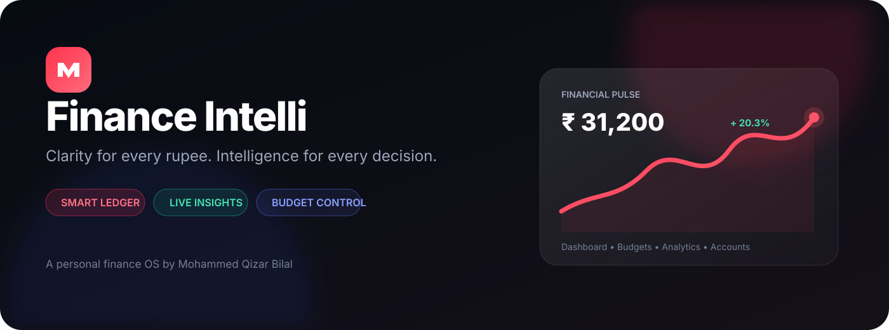
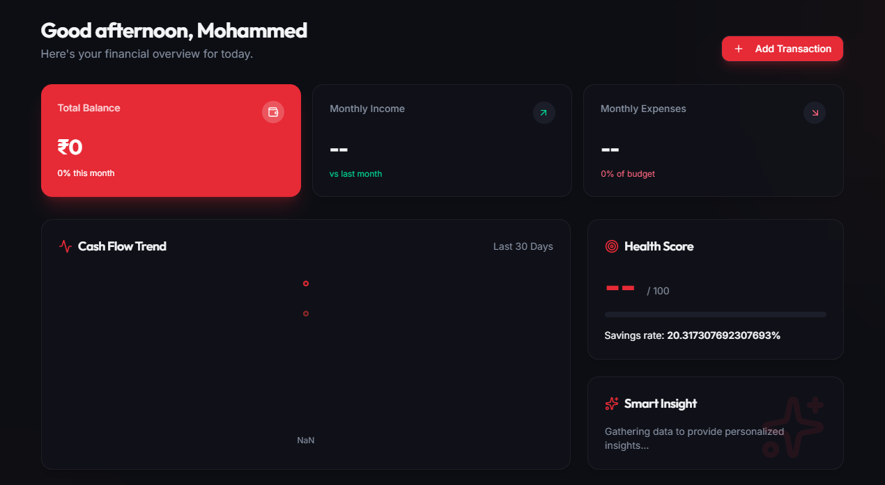
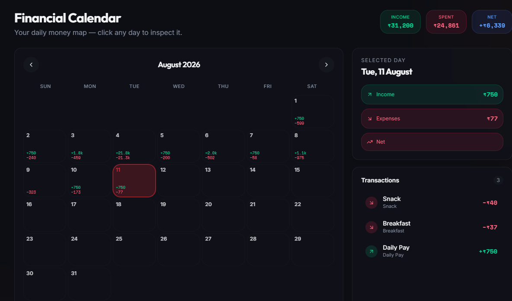
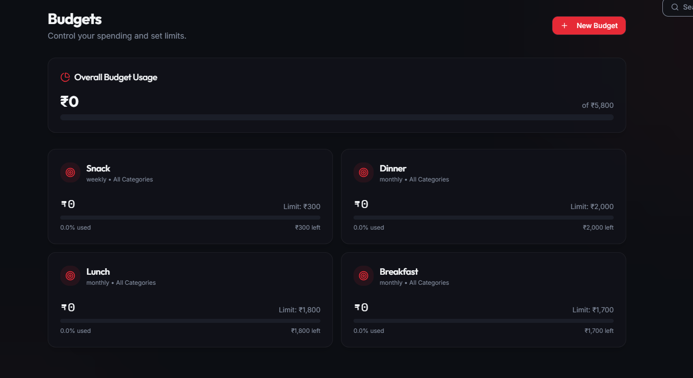
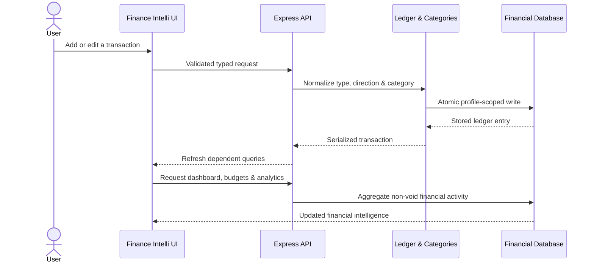
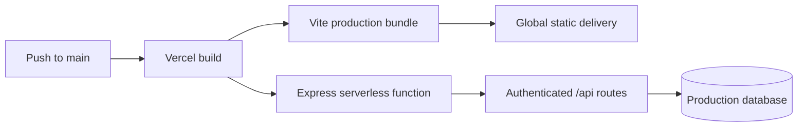

<div align="center">



<br />

[](https://finance-intelli.vercel.app/)
[](https://react.dev/)
[](https://www.typescriptlang.org/)
[](https://vercel.com/)

### Your money, translated into clarity.

Finance Intelli is a full-stack personal finance operating system for tracking accounts, transactions, budgets, goals, reminders, cash flow, and long-term financial health from one polished workspace.

[Explore the live product](https://finance-intelli.vercel.app/) · [Architecture](#-architecture) · [Run locally](#-local-development) · [Meet the creator](#-crafted-by-mohammed-qizar-bilal)

</div>

---

## ✦ The product at a glance

| Financial command | What Finance Intelli delivers |
|---|---|
| **See** | Dynamic balances, income, expenses, savings rate, health score, and recent activity |
| **Understand** | Cash-flow trends, category distribution, calendar heatmaps, and savings growth |
| **Control** | Category-aware budgets, thresholds, recurring activity, and account management |
| **Plan** | Goals, reminders, reports, wealth views, and an actionable financial command centre |
| **Protect** | Profile-scoped records, soft deletion, audit history, secure sessions, and validated ledger writes |

> **Design philosophy:** serious financial data should feel calm, legible, and actionable—not like a spreadsheet wearing a dashboard.

## ◈ Product tour

### Financial command dashboard

Real-time financial KPIs, a 30-day cash-flow narrative, health scoring, smart insights, and recent transactions—designed to answer “How am I doing?” in seconds.



### Daily money map

The Financial Calendar turns every date into an inspectable income/expense story, with day-level totals and transaction details.



### Category-aware budget control

Budgets automatically measure qualifying expenses by period and category, including backward-compatible matching for previously created named budgets.



## ◎ Core capabilities

<table>
<tr><td width="50%" valign="top">

### Dashboard intelligence

- Today, weekly, monthly, and yearly rollups
- Net-worth-aware account aggregation
- Cash-flow charts with resilient numeric formatting
- Savings rate and financial health scoring
- Recent activity and personalized insights

</td><td width="50%" valign="top">

### Transaction ledger

- Income, expense, and balanced transfers
- Categories, merchants, tags, notes, and status
- Search, filtering, sorting, and pagination
- Soft deletion and optimistic version checks
- Per-user category normalization

</td></tr>
<tr><td width="50%" valign="top">

### Budgets & planning

- Daily, weekly, monthly, yearly, and custom periods
- Category-specific or all-expense tracking
- Usage thresholds and remaining-budget indicators
- Financial goals and recurring contributions
- Bills, reminders, and forward planning

</td><td width="50%" valign="top">

### Accounts & analytics

- Bank, cash, card, loan, investment, and wallet accounts
- Create, edit, archive/delete, transfer, and reconcile
- Income-versus-expense and net-savings charts
- Category distribution and spending heatmaps
- Calendar, wealth, and downloadable report views

</td></tr>
</table>

## ⟳ How money flows through the system


### Transaction-to-insight workflow



## ⬡ Architecture

```text
Finance-Intelli/
├── api/                              # Vercel serverless entry point
├── artifacts/
│   ├── api-server/                   # Express API application
│   │   └── src/
│   │       ├── lib/                  # Finance, dates, accounts, audit helpers
│   │       ├── middlewares/          # Authentication and request guards
│   │       └── routes/               # REST endpoints and aggregations
│   ├── finance-intelli/              # React + Vite web application
│   │   └── src/
│   │       ├── components/           # UI primitives and application layout
│   │       ├── hooks/                # Shared React behaviors
│   │       ├── lib/                  # Client utilities
│   │       └── pages/                # Product surfaces and workflows
│   └── mockup-sandbox/               # Isolated UI exploration workspace
├── lib/
│   ├── api-client-react/             # Generated TanStack Query client
│   ├── api-spec/                     # OpenAPI source of truth
│   ├── api-zod/                      # Generated runtime validation schemas
│   └── db/                           # Drizzle schema and migrations
├── scripts/                          # Workspace and migration utilities
├── docs/readme/                      # README artwork and product screenshots
├── pnpm-workspace.yaml               # Monorepo package map
└── vercel.json                       # Production routing and build config
```

## ⚙ Technology map

| Layer | Technology | Responsibility |
|---|---|---|
| Experience | React 19, Vite, Wouter, Tailwind CSS, shadcn/ui | Responsive application shell and feature pages |
| Motion & data | Framer Motion, Recharts, TanStack Query | Interaction, visualization, caching, invalidation |
| API | Express 5, Zod/OpenAPI-generated contracts | Authenticated endpoints and input validation |
| Persistence | Drizzle ORM, PostgreSQL | Profile-scoped ledger and financial records |
| Security | JWT sessions, secure cookies, Helmet, CORS, rate limiting | Session integrity and production hardening |
| Delivery | pnpm workspaces, TypeScript, Vercel | Reproducible builds and serverless deployment |

> **MongoDB Atlas note:** Atlas variables and migration guidance are included for the planned repository migration. The active ledger implementation in this codebase currently uses PostgreSQL through Drizzle; switching databases requires a reconciled data migration, not only an environment-variable change.

## ▶ Local development

### Prerequisites

- Node.js 24+
- pnpm 11+
- PostgreSQL database

### 1. Clone and install

```bash
git clone https://github.com/QizarBilal/Finance-Intelli.git
cd Finance-Intelli
pnpm install --frozen-lockfile
```

### 2. Configure the environment

```bash
cp .env.example .env
```

Set a strong `SESSION_SECRET`, the permitted `ALLOWED_ORIGINS`, and the active database connection. Never commit production credentials.

### 3. Run the applications

```bash
# API
pnpm --filter @workspace/api-server dev

# Web app (separate terminal)
pnpm --filter @workspace/finance-intelli dev
```

### 4. Verify before shipping

```bash
pnpm run typecheck
pnpm test
pnpm --filter @workspace/api-server run build
pnpm --filter @workspace/finance-intelli run build
```

## ☁ Deployment



The root `vercel.json` builds the web artifact, maps `/api/*` to the Express function, preserves SPA routing, and applies long-lived caching to fingerprinted assets.

## ✓ Engineering principles

- **Financial correctness first** — transfers balance, void/deleted entries are excluded, and aggregation rules stay explicit.
- **No surprise data loss** — transactions are soft-deleted and accounts with history are archived.
- **Multi-user isolation** — reads and writes are scoped to the authenticated profile.
- **Typed boundaries** — OpenAPI, generated clients, and runtime schemas reduce contract drift.
- **Timezone-safe dates** — financial periods respect the user’s IANA timezone and configured week start.
- **Accessible, responsive UI** — keyboard-friendly primitives and adaptive layouts across desktop and mobile.

## ◇ Roadmap ideas

- Complete the reconciled PostgreSQL-to-MongoDB Atlas repository migration
- Expand automated aggregation and route integration coverage
- Add CSV/OFX bank import with duplicate detection
- Introduce configurable dashboard widgets and richer forecasting
- Add CI quality gates, dependency scanning, and preview smoke tests

## ♡ Crafted by Mohammed Qizar Bilal

<div align="center">

### **Mohammed Qizar Bilal**

Builder of thoughtful digital products where engineering, design, and practical intelligence meet.

[](https://github.com/QizarBilal)
[](https://finance-intelli.vercel.app/)

<sub>Designed and engineered with care, curiosity, and a belief that better information creates better decisions.</sub>

</div>

---

<div align="center">

If Finance Intelli inspires you, consider giving the repository a ⭐

**© 2026 Mohammed Qizar Bilal. Built with purpose.**

</div>
